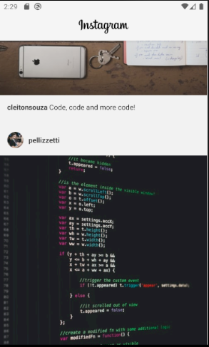

# Instagram Clone (App)

A basic instagram clone (app) made with react-native, styled-components, animated components, lazy load images.

Mainly made with styled components.




## Project setup

```
yarn install
```

### Compiles and hot-reloads for development

```
yarn start
```

```
yarn android
```

```
yarn ios
```

### Start json-server

```
yarn json-server
```

### Lints and fixes files

```
yarn lint
```

### Run the Prettier

```
yarn format
```
